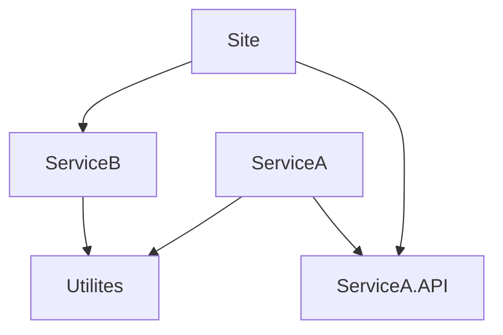

+++
title= "Mono Build"
chapter= false
date= 2023-01-27T22:37:18Z
draft= false
+++

# MonoBuild

## The problem

For a solution with multiple deliverable services/packages, we have two options when it comes to Git repository organization:

1. Have multiple Git repositories, probably one per service/package. We can have a CI/CD pipeline per repository.
1. Have one Git repository with all our deliverables in and have multiple build pipelines which are triggered by a commit to the release branch. 

Option one means that we have fine grain control on when deployments happen. When we want to deploy, we merge our changes to the deployment branch of the item we want to release. As the number of deployable items grow, it becomes difficult to keep track of what needs to be deployed for a given change, when you get to 20-30 interdependent services it can easily start to become unmanageable.

With option two we don't have this problem; whenever we merge our change to the deployment branch every build we have configured will run. This is not ideal as our release cadence is limited to the slowest build. Therefore all builds need to complete before the next release can occur so any failing builds become an issue holding up releases of other probably unrelated changes.

**MonoBuild** aims to help solve issues with option two so that only the required builds for any given changeset are triggered. This can speed up deployment frequency, reduce build times and compute requirements.

## The Solution

**MonoBuild** is a command line utility which you utilise in your release pipeline to decide if any particular build needs to occur. How does it do this? It utilises the dependencies in your project structure to give a yes/no decision on if a build needs to proceed.

#### A quick example

Given a project set up as below:



Using **MonoBuild** without any configuration (assuming C#, F# project), if we commit a change to a ```Service A API\MakePurchaseCommand.cs``` we can execute the following:

>  Assuming monobuild is on your path.

```Powershell
>monobuild -t "ServiceA" -q YES
<YES>
>monobuild -t Site -q YES
<YES>
>monobuild -t Utilities -q YES
<NO>
>monobuild -t "ServiceB" -q YES
<NO>
>monobuile -t Utilites -q YES
<NO>
```


The `-t` indicates the target of the build and `-q` suppresses a little extra output you get with a `<YES>`

* Don't want to release the site because of a change in utilities? No problem you can configure that.
* Don't want to release if a Markdown file changes? No problem, you can configure that
* Don't want to release site if for any changes in ServiceB unless it is the contracts directory? Not a problem, we can configure that.
* Don't use C# or F#? No problem, you can configure your dependencies manually, or drop a PR to [the repo](https://github.com/JohnEffo/MonoBuild) the code for we use for a [C# project file](https://github.com/JohnEffo/MonoBuild/blob/main/src/MonoBuild.Core/ProjDependencyExtractor.cs) is pretty simple.


