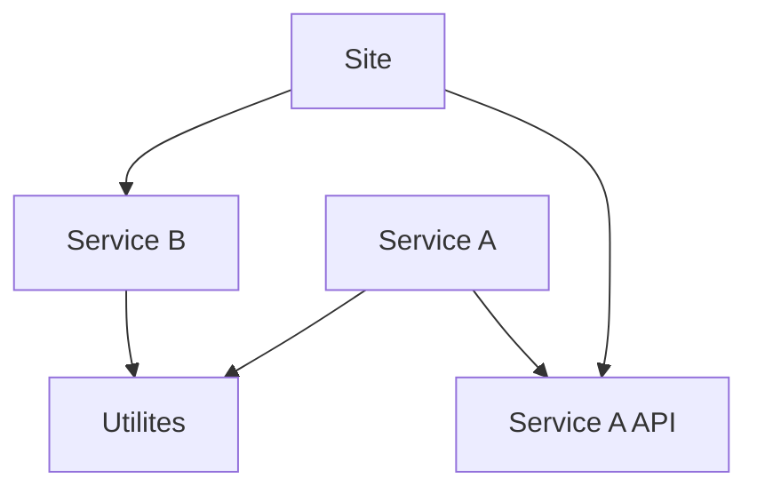
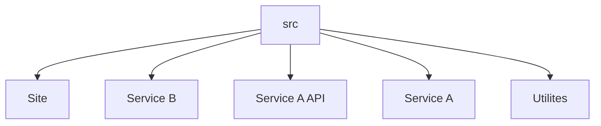

+++
title = "Worked Example"
date = 2023-01-30T22:05:33Z
weight = 10
chapter = false
pre = "<b>1.3. </b>"
draft = true
+++

On the front page we showed a code hierarchy and said that Monobuild could do all of the following

* Don't want to release the site because of a change in utilities.
* Don't want to release if a Markdown file changes.
* Don't want to release site if for any changes in ServiceB unless it is the contracts directory.
* Don't use C# or F#, pyou can configure your dependencies manually.

#### Project Structure


In this section we will show how to do all of the things we stated as possible on the front page. The diagram above Shows the project structure from a dependency point of view,  but a more common layout directory wise would be as below:  

#### Folder Structure



#### Lets create the project

The script below creates a Demo directory, creates the project structure of the first diagram in the directory structure of the second and initialises a Git repository and commits. 

```shell
md Demo
cd Demo
dotnet new gitignore
dotnet new classlib  -o src/Utilities
dotnet new classlib -o src\ServiceA.API\
dotnet new webapi -o src/ServiceA
dotnet new webapi -o src/ServiceB
dotnet new mvc -o src/Site
dotnet new sln
dotnet sln add .\src\Utilities\
dotnet sln add .\src\ServiceA\
dotnet sln add .\src\ServiceB\
dotnet sln add .\src\Site
dotnet sln add .\src\ServiceA.API\
dotnet add .\src\ServiceA\ServiceA.csproj reference .\src\Utilities\
dotnet add .\src\ServiceA\ServiceA.csproj reference .\src\ServiceA.API\
dotnet add .\src\ServiceB\ServiceB.csproj reference .\src\Utilities\
dotnet add .\src\Site\Site.csproj reference .\src\ServiceB
dotnet add .\src\Site\Site.csproj reference .\src\ServiceA.API\
git init
git add .
git commit -m"Intitial Commit"
```

- Don't want to release the site because of a change in utilities.
    - Firstly lets see what happens if we do not ignore a change. 
    - Make an update to the src\Utilites\Class1.cs
    - Commit the change:- using ```git add .``` and ```git commit -m"update utilties"```
    - In the Demo directory execute ```monobuild -t .src/Site```, you should see the results below.
      ```shell
        ❯ monobuild -t .\src\Site
        The following files changed:
        src/Utilities/Class1.cs
        <YES>
      ``` 
     - As there is no direct dependency between Site and Utilites we need to create one, create a file in src/Site/.monobuild.deps
       ```shell
       ..\utilities
       ```
     - Now we have a dependency we can ignore any globing patterns we like within the directory. 
        - Create a file src/Site/.monobuild.ignore
        - Copy the contents below into the file.
       ```shell
       ..\utilities\**\*
       ```
     - Make sure both files are saved
     - Execute ```monobuild -t .src/Site``` again, you should see the results below.
        ```shell
        ❯ monobuild -t .\src\Site
        <NO>
        ```
  - Don't want to release if a Markdown file changes

  This is simply a case of adding an ignore to our ignore file, but we will also demonstrate that ignore files only affect the build directory which they are parented in.

    - Create a file ```src\Site\readme.md``` 
    - Create a file ```src\ServicB\readme.md```
    - Commit the change:- using ```git add .``` and ```git commit -m"Added readme files"```
    - Execute ```monobuild -t .src/Site``` you should see:
    ```shell
    ❯ monobuild -t .\src\Site
    The following files changed:
    src/Site/readme.md
    src/ServiceB/readme.md
    <YES>
    ```
    - In src/Site/.monobuild.ignore add ```**\*.md``` the complete file will now look like this
    ```
    ..\utilities\**\*
    **\*\md
    ```
    - Execute ```monobuild -t .src/Site``` again, you should see the results below.
    ```shell
    The following files changed:
    src/ServiceB/readme.md
    <YES>
    ```

    > Notice we have only removed the file in Site to ingore Markdown files in ServiceB we need to add another ignore file to SeviceB

    - Create a file src/ServiceB/.monobuild.ingore with ```**\*.md``` as the ignore glob.
    - Execute ```monobuild -t .src/Site```, no build is now required.

- Don't want to release site if for any changes in ServiceB unless it is the contracts directory

